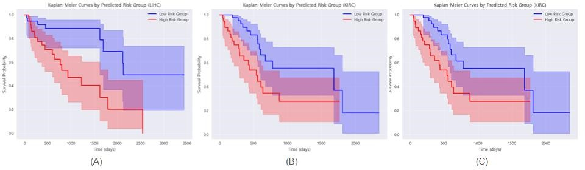

# Cinical_Data_Cancer

-----
## Clinical Data Analysis for Cancer Prognosis and Treatment Effect Prediction

## 1\. 프로젝트 개요 (Project Overview)

이 프로젝트는 The Cancer Genome Atlas (TCGA) 데이터를 활용하여 다양한 암종(간암, 신장암, 난소암, 위암)에 대한 임상 데이터 기반의 생존 예측, 위험도 계층화, 그리고 치료 효과 예측 모델을 개발하고 평가합니다. 환자 개개인의 임상 특성을 분석하여 맞춤형 의사 결정을 지원하는 것을 목표로 합니다.

## 2\. 연구 목적 (Research Objectives)

  * **생존 예측 (Survival Prediction)**: 환자의 임상 데이터를 기반으로 생존 기간을 예측하는 모델을 개발합니다.
  * **위험도 계층화 (Risk Stratification)**: 환자를 저위험군, 중위험군, 고위험군으로 분류하여 질병의 진행 위험도를 예측합니다.
  * **치료 효과 예측 (Treatment Effect Prediction)**: 특정 치료(수술, 항암화학요법, 방사선 치료 등)가 환자 결과에 미치는 영향을 예측하여 최적의 치료법 선택을 돕습니다.
  * **설명 가능한 AI (Explainable AI, XAI)**: 개발된 모델의 예측 결과를 설명할 수 있도록 SHAP 및 LIME과 같은 XAI 기법을 적용하여 임상적 해석 가능성을 높입니다.
  * **CDSS (Clinical Decision Support System) 호환성**: 모델이 임상 의사 결정 지원 시스템에 통합될 수 있도록 호환성을 고려하여 개발합니다.

## 3\. 기술 스택 (Tech Stack)

이 프로젝트는 다음 기술 스택을 활용하여 개발되었습니다.

  * **언어 (Language)**:
      * `Python 3.x`
  * **주요 라이브러리 (Core Libraries)**:
      * `Pandas`: 데이터 조작 및 분석
      * `Numpy`: 수치 계산
      * `Scikit-learn`: 일반 머신러닝 모델 및 유틸리티
      * `Scikit-survival`: 생존 분석 모델
      * `Lifelines`: 생존 분석 모델
      * `XGBoost`: Gradient Boosting 머신러닝 프레임워크
      * `LightGBM`: Gradient Boosting 머신러닝 프레임워크
  * **설명 가능한 AI (Explainable AI - XAI)**:
      * `SHAP`: 모델 예측에 대한 특징 기여도 분석
      * `LIME`: 로컬 모델 설명 생성
  * **시각화 (Visualization)**:
      * `Matplotlib`: 정적, 대화형 시각화
      * `Seaborn`: 통계 데이터 시각화
  * **개발 환경 (Development Environment)**:
      * `Jupyter Notebook` 또는 `Jupyter Lab`

## 4\. 데이터셋 (Dataset)

본 프로젝트는 다음 TCGA 암종의 임상 데이터를 사용합니다.

  * **간암 (Liver Cancer - TCGA-LIHC)**
  * **신장암 (Kidney Cancer - TCGA-KIRP)**
  * **난소암 (Ovarian Cancer - TCGA-OV)**
  * **위암 (Stomach Cancer - TCGA-STAD)**

### 4.1 데이터 출처 (Data Source)

모든 임상 데이터는 The Cancer Genome Atlas (TCGA)에서 제공되며, Genomic Data Commons (GDC) 포털을 통해 접근하여 수집되었습니다.

### 4.2 환자 코호트 요약 (Patient Cohort Summary)

| 암종 | 총 환자 수 | 분석에 사용된 환자 수 (생존/위험도/치료 효과) |
| :--- | :--------: | :-------------------------------------------: |
| 간암 |    377     |                      372                      |
| 신장암 |    291     |                      288                      |
| 난소암 |    608     |                  583 (생존), 608 (위험도)                   |
| 위암 |    443     |                      416                      |

### 4.3 포함/제외 기준 (Inclusion/Exclusion Criteria)

  * 유효한 생존 데이터를 가진 환자 (생존 기간 \> 0 이고 결측값이 아닌 경우)를 포함합니다.
  * 데이터 수집 시점 또는 분석 과정에서 특정 변수들이 80% 이상의 높은 결측률을 보이는 경우 해당 변수들은 분석에서 제외되었습니다.
      * 예: `days_to_death`, `treatments_pharmaceutical_treatment_outcome`, `year_of_birth`, `year_of_death` 등
  * 각 모델의 목적에 따라 추가적인 환자 필터링이 적용될 수 있습니다.

## 5\. 데이터 전처리 (Data Preprocessing)

### 5.1 결측치 처리 (Missing Value Imputation)

  * **높은 결측률 컬럼 제거**: 특정 임계값(예: 80%)을 초과하는 결측치를 가진 컬럼은 분석에서 제외됩니다.
  * **수치형 변수**: 결측치는 해당 컬럼의 \*\*중앙값 (median)\*\*으로 대체됩니다.
  * **범주형 변수**:
      * `Unknown` 또는 `NaN` 값을 가진 범주형 변수들은 해당 컬럼의 \*\*최빈값 (mode)\*\*으로 대체됩니다.
      * 일부 임상적으로 중요한 변수(`child_pugh_classification`, `ishak_fibrosis_score`, `ajcc_pathologic_stage`, `race`, `ethnicity` 등)의 경우, 임상적 의미를 고려하여 특정 값(예: 'A', 'R0', 'white', 'not hispanic or latino')으로 대체될 수 있습니다.

### 5.2 데이터 분할 (Data Splitting)

  * 전체 데이터셋은 **훈련 (Training), 검증 (Validation), 테스트 (Test)** 세트로 **60:20:20**의 비율로 분할됩니다.
  * **CDSS 테스트 환자**: 각 암종 및 모델별로 1명의 환자를 별도로 홀드아웃하여 CDSS 호환성 및 단일 환자 예측 테스트에 사용했습니다.
  * **계층적 분할 (Stratified Splitting)**:
      * 난소암 위험도 계층화 모델의 경우, 일부 클래스의 데이터 불균형을 해소하고 각 위험도 범주(저위험, 중위험, 고위험) 간의 균형 잡힌 분포(약 33.3%씩)를 보장하기 위해 강제 계층적 분할을 수행했습니다.
      * 다른 모델에서는 명시적으로 계층적 분할을 적용했다는 언급은 없습니다.

### 5.3 특징 엔지니어링 (Feature Engineering)

  * 위암 치료 효과 예측 모델(개선된 버전)에서는 환자 특성 및 치료 관련 정보를 통합하기 위해 `comprehensive_risk_score`, `treatment_intensity`, `age_stage_interaction`, `grade_stage_interaction`과 같은 새로운 특징을 생성했습니다.

## 6\. 모델 구축 및 학습 (Model Construction and Training)

### 6.1 사용된 모델 (Models Used)

다양한 머신러닝 모델이 각 예측 과제에 맞게 활용되었습니다.

  * **생존 예측 모델**:
      * Cox Proportional Hazard Model (CoxPH) (scikit-survival, lifelines)
      * Random Survival Forest (RSF)
      * Gradient Boosting Survival Analysis (GBSA)
  * **위험도 계층화 모델 (분류)**:
      * Random Forest Classifier
      * XGBoost Classifier
      * Logistic Regression
  * **치료 효과 예측 모델 (분류)**:
      * Random Forest Classifier
      * XGBoost Classifier
      * LightGBM Classifier
      * (위암 개선 버전) 앙상블 모델

### 6.2 학습 설정 (Training Settings)

모델 학습에 대한 구체적인 하이퍼파라미터는 각 암종 및 모델별 노트북(`.ipynb`) 파일 내에서 확인 가능합니다. 일반적인 학습 설정은 다음과 같습니다.

  * **옵티마이저**: 각 모델의 기본 또는 권장 옵티마이저 (예: LightGBM의 경우 내부 최적화 기법 활용).
  * **조기 종료 (Early Stopping)**: LightGBM과 같은 부스팅 모델에서 과적합을 방지하고 학습 시간을 단축하기 위해 10라운드 동안 검증 점수 개선이 없을 시 학습을 중단하는 조기 종료 기법을 적용했습니다.
  * **손실 함수**: 각 모델의 목적에 맞는 손실 함수 (예: 생존 분석의 경우 Cox Loss, 분류의 경우 Binary Cross-Entropy 또는 Multi-class Logloss).

## 7\. 평가 및 검증 (Evaluation and Validation)

### 7.1 성능 지표 (Performance Metrics)

  * **생존 예측**: \*\*C-index (Concordance Index)\*\*를 사용하여 모델의 예측 정확도를 평가했습니다.
  * **위험도 계층화 및 치료 효과 예측 (분류)**: **정확도 (Accuracy)** 및 \*\*AUC (Area Under the Receiver Operating Characteristic Curve)\*\*를 주요 지표로 활용했습니다.

### 7.2 평가 설정 (Evaluation Settings)

  * **내부 검증**: 훈련, 검증, 테스트 세트에서 모델 성능을 평가했습니다.
  * **교차 검증 (Cross-validation)**: 최종 모델 평가에 명시적인 K-fold 교차 검증 적용 여부는 보고서에 명시되지 않았지만, 모델 훈련 또는 하이퍼파라미터 튜닝 과정에서 내부적으로 활용되었을 수 있습니다.
  * **외부 검증 (External Validation)**: 별도의 독립적인 외부 데이터셋(예: TCGA-KICH와 같은 다른 코호트)을 사용한 외부 검증은 수행되지 않았습니다. 프로젝트의 CDSS 호환성을 위해 홀드아웃된 단일 환자 테스트는 수행했습니다.

## 8\. 결과 및 해석 (Results and Interpretation)

각 암종 및 예측 과제별 상세 결과는 해당 폴더 내의 `*_report.txt` 파일에 요약되어 있습니다. 보고서에는 모델 성능 지표, 주요 특징의 중요도, 그리고 XAI 분석 결과(SHAP, LIME)가 포함되어 있습니다.



## 9\. 프로젝트 구조 (Project Structure)

```
.
├── clinical model/
│   ├── kidney/
│   │   ├── RISK STRATIFICATION/
│   │   │   ├── kidney_risk.ipynb
│   │   │   └── kidney_cancer_risk_analysis_report.txt
│   │   ├── SURVIVAL_PREDICTION/
│   │   │   ├── kidney_survival.ipynb
│   │   │   └── kidney_cancer_survival_analysis_report.txt
│   │   ├── TREATMENT EFFECT/
│   │   │   ├── kidney_treatment.ipynb
│   │   │   └── kidney_cancer_treatment_effect_analysis_report.txt
│   │   └── TCGA-KIRP_clinical_data.csv
│   ├── liver/
│   │   ├── RISK STRATIFICATION/
│   │   │   ├── retry/
│   │   │   │   ├── retry.ipynb
│   │   │   │   └── liver_cancer_risk_classification_cdss_report.txt
│   │   │   ├── tcga_lihc_risk_stratification_report.txt
│   │   │   └── risk_stratification_retry.ipynb
│   │   ├── SURVIVAL_PREDICTION/
│   │   │   ├── retry/
│   │   │   │   ├── retry.ipynb
│   │   │   │   └── liver_cancer_survival_xai_cdss_report.txt
│   │   │   ├── survival_prediction.ipynb
│   │   │   └── liver_cancer_survival_report.txt
│   │   ├── TREATMENT EFFECT/
│   │   │   ├── retry/
│   │   │   │   ├── retry.ipynb
│   │   │   │   └── liver_cancer_treatment_effect_prediction_cdss_overfitting_fixed_report.txt
│   │   │   ├── treatment_effect_prediction.ipynb
│   │   │   └── liver_cancer_treatment_effect_prediction_report.txt
│   │   └── clinical_data_liver.csv
│   ├── ovarian/
│   │   ├── RISK STRATIFICATION/
│   │   │   ├── ov_risk.ipynb
│   │   │   └── ovarian_cancer_risk_analysis_report.txt
│   │   ├── SURVIVAL_PREDICTION/
│   │   │   ├── ov_survival.ipynb
│   │   │   └── ovarian_cancer_survival_analysis_report.txt
│   │   └── TCGA-OV_clinical_data.csv
│   ├── stomach/
│   │   ├── RISK STRATIFICATION/
│   │   │   ├── stomach_risk.ipynb
│   │   │   └── gastric_cancer_risk_analysis_report.txt
│   │   ├── SURVIVAL_PREDICTION/
│   │   │   ├── stomach_survival.ipynb
│   │   │   └── gastric_cancer_survival_analysis_report.txt
│   │   ├── TREATMENT EFFECT/
│   │   │   ├── retry/
│   │   │   │   ├── stomach_treat_retry.ipynb
│   │   │   │   └── improved_gastric_cancer_treatment_effect_analysis_report.txt
│   │   │   ├── stomach_treatment.ipynb
│   │   │   └── gastric_cancer_treatment_effect_analysis_report.txt
│   │   └── TCGA-STAD_clinical_data.csv
│   ├── column_analysis.txt
│   └── clinical 컬럼명 확인.ipynb
└── README.md (이 파일)
```

## 10\. 시작하기 (Getting Started)

### 10.1 필요 조건 (Prerequisites)

이 프로젝트를 로컬에서 실행하려면 다음 소프트웨어 및 라이브러리가 설치되어 있어야 합니다.

  * Python 3.x
  * Jupyter Notebook (또는 Jupyter Lab)

필요한 Python 라이브러리는 `requirements.txt` 파일에 명시될 수 있으며, 다음 명령으로 설치할 수 있습니다.

```bash
pip install -r requirements.txt
```

### 10.2 설치 및 실행 (Installation and Usage)

1.  이 저장소를 클론합니다:
    ```bash
    git clone https://github.com/your_username/your_repository_name.git
    cd your_repository_name
    ```
2.  필요한 라이브러리를 설치합니다 (위 `requirements.txt` 파일이 있다고 가정).
3.  Jupyter Notebook 또는 Jupyter Lab을 시작합니다:
    ```bash
    jupyter notebook
    ```
    또는
    ```bash
    jupyter lab
    ```
4.  Jupyter 인터페이스에서 원하는 암종 및 분석 과제 폴더로 이동하여 해당 `.ipynb` 파일을 열고 실행합니다. 각 `.ipynb` 파일은 데이터 로드부터 전처리, 모델 학습, 평가 및 XAI 분석까지의 전체 파이프라인을 포함하고 있습니다.


-----